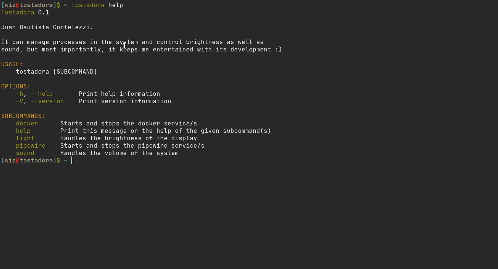

# Tostadora

Behold the ultimate weapon against my short lived memory, with this awesome Rust
command line interface I will never have to remember stupid commands again!

Now I can use this tool to control the brightness of my display and the volume
of my system. Moreover it can start and stop services like docker or pipewire in
order to consume less RAM.

